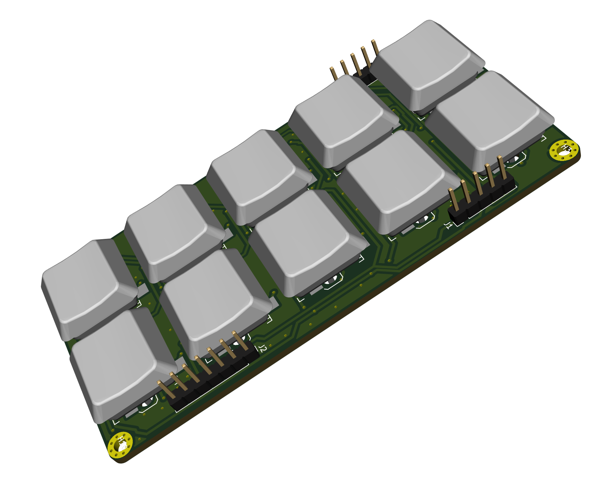

# Wing's First Iteration Simple Keyboard

* 2x5 keyswitch layout
* Kailh PG1350 low profile key switches
* 2020 WS2812B RGB led under each key
* Using footprints that allow for swappable keyswitch mounts.
* Added diode for each key switch.
* Added 2.54mm spaced headers for ROW/COL for the key switches and DI/DO/VCC/GND for the LED(s)

# Keyboard Organization

* 2 columns
* 5 rows
* row and column lines brought in in a 2.54mm 1x7 header

# LED Organization

* WS2812B 2020 (2.0x2.0mm) RGB led(s). DIN and DOUT chained in the following manner:

| WS2812B RGB LED  | Position (Row,Col) | Next In Line (Row, Col) |
| :--------------- | :-------:          | :-----:                 |
| LED 1            | (1,1)              | (1,2)                   |
| LED 2            | (1,2)              | (2,1)                   |
| LED 3            | (2,1)              | (2,2)                   |
| LED 4            | (2,2)              | (3,1)                   |
| LED 5            | (3,1)              | (3,2)                   |
| LED 6            | (3,2)              | (4,1)                   |
| LED 7            | (4,1)              | (4,2)                   |
| LED 8            | (4,2)              | (5,1)                   |
| LED 9            | (5,1)              | (5,2)                   |
| LED 10           | (5,2)              | DOUT                    |

# Mounting

* M2.5 mounting holes in the corners
* Inset 2.5mm from edges
* Mount hole plating is electrically connected to GND

